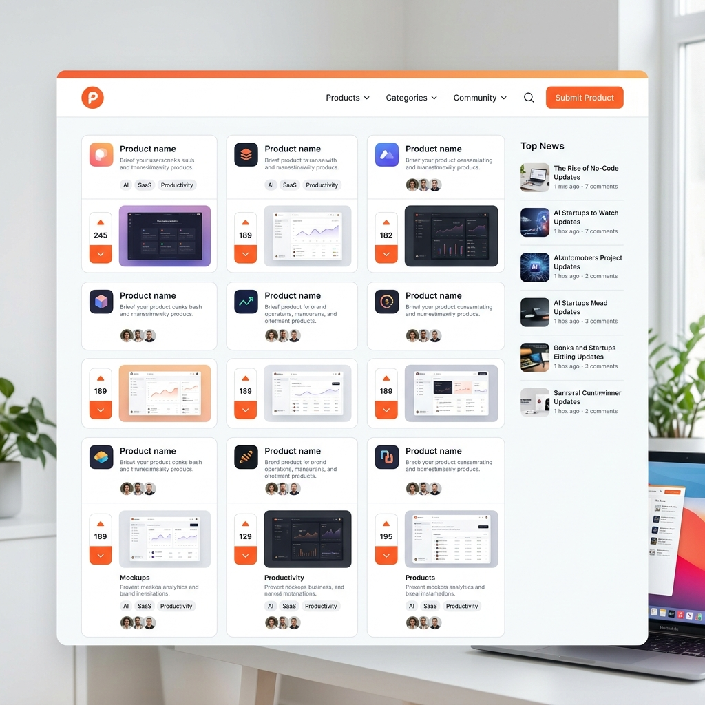

# 🚀 Product Hunt Clone - "The Maker's Hub"



## 🌟 Overview

Welcome to **The Maker's Hub**, a high-fidelity, production-grade clone of [Product Hunt](https://www.producthunt.com/). This project was built as a group capstone to demonstrate proficiency in modern full-stack web development, specifically focusing on complex UI layouts, dynamic state management, and seamless user experiences.

The platform serves as a discovery engine for the latest tech products, allowing users to browse, upvote, discuss, and launch new innovations.

---

## 🎯 Why We Built This

We chose to clone Product Hunt because it presents unique architectural challenges:
1. **Content Hierarchy**: Managing daily-rotating product lists with complex metadata.
2. **Interactive Community**: Building thread-based discussion systems that feel alive.
3. **Responsive Aesthetics**: Implementing a multi-column layout that gracefully transitions from desktop to mobile.
4. **Performance**: Leveraging React 19 and Vite for lightning-fast interactions and transitions.

---

## ✨ Core Features

### 🛠️ Live Product Discovery
- **Daily Launches**: Browse products organized by day, mirroring the real Product Hunt flow.
- **Upvoting System**: Interactive upvote logic with real-time feedback (simulated via local state).
- **Product Details**: Deep-dive pages for every product with descriptions, makers, and tags.

### 💬 Community & Threads
- **Maker Discussions**: A dedicated community section for sharing ideas and asking questions.
- **Thread Detail Views**: Comprehensive views for long-form discussions and feedback loops.

### 🔍 Search & Filtering
- **Real-time Search**: Instant filtering of products and community threads as you type.
- **Dynamic Navigation**: Seamless routing between categories and launch dates.

### 🚀 Maker Tools
- **Product Launch**: A streamlined submission flow for makers to introduce their products to the world.
- **Advertise Page**: A premium, high-conversion landing page designed for platform partnerships.

### 🔮 Future-Ready Modules
- **Coming Soon Teasers**: Beautifully designed modules for "Launches", "Tech News", and "Enhanced Forums" currently in development.
- **Newsletter Modal**: Integrated subscription system to keep users engaged.

---

## 💻 Tech Stack

- **Frontend**:  **19** & 
- **Styling**:  (Modern Vanilla CSS with high-fidelity modules)
- **Animations**:  (Framer Motion)
- **Icons**: 
- **Routing**:  **7**
- **Backend (Mock)**: 

---

## 📂 Project Structure

```bash
src/
├── components/        # Reusable UI components (ProductCard, Navbar, Modals)
├── pages/             # Page-level components (Home, ProductDetail, Threads)
├── data/              # Mock data and constants
├── hooks/             # Custom React hooks
├── App.jsx            # Main routing and application layout
└── main.jsx           # Entry point
```

---

## 🚀 Getting Started

### Prerequisites
- Node.js (v18 or higher)
- npm or yarn

### Installation

1. **Clone the repository**:
   ```bash
   git clone https://github.com/AbhimanRajCoder/PRODUCTHUNT-CLONE.git
   cd PRODUCTHUNT-CLONE
   ```

2. **Install dependencies**:
   ```bash
   npm install
   ```

3. **Start the Mock API (JSON Server)**:
   ```bash
   npm run server
   ```

4. **Run the Development Server**:
   ```bash
   npm run dev
   ```

5. **Open your browser**:
   Navigate to `http://localhost:5173`

---

## 🤝 Contributing

This is a group project. Feel free to fork it, open issues, or submit pull requests to help us make it even better!

---

## 📄 License

This project is open-source and available under the [MIT License](LICENSE).

---

Developed with ❤️ by the Product Hunt Clone Team.
